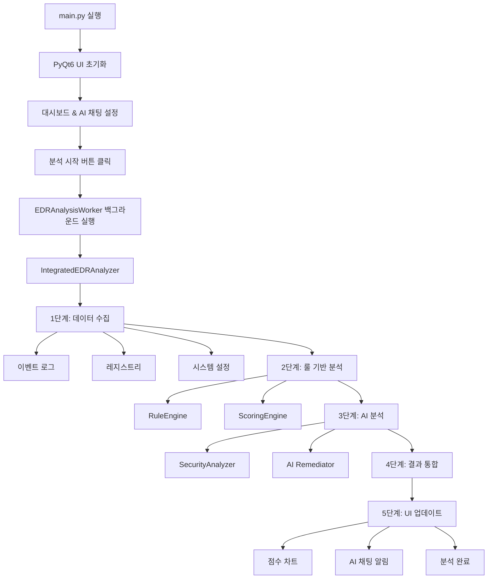

# 🛡️ 경량 Windows EDR Scanner

**SK Rookies 모듈프로젝트(2) - 3조**

중소기업 환경에서 설치·운영 부담을 최소화한 **원클릭 스캐너형 EDR(Endpoint Detection and Response)** 솔루션입니다. 
실행하면 단일 창(UI)이 뜨고 **[분석 시작]** 버튼을 누르면 그 시점의 보안 관련 아티팩트를 일괄 수집→룰 기반 분석→AI 가이드 생성→시각화까지 한 번에 수행합니다.


## 목차

- [프로젝트 개요](#-프로젝트-개요)
- [주요 기능](#-주요-기능)
- [시스템 아키텍처](#️-시스템-아키텍처)
- [프로젝트 구조](#-프로젝트-구조)
- [설치 및 실행](#️-설치-및-실행)
- [사용법](#-사용법)
- [AI 기능](#-ai-기능)
- [분석 항목](#-분석-항목)
- [점수화 시스템](#-점수화-시스템)
- [기술 스택](#-기술-스택)
- [팀 구성](#-팀-구성)
- [개발 일정](#-개발-일정)
- [문제 해결](#-문제-해결)
- [라이선스](#-라이선스)

## 프로젝트 개요

### 문제 정의 및 필요성
- **인력/예산 제약**: SIEM/XDR 없이도 "지금 우리 PC가 안전한가?"를 즉시 진단
- **복잡도/운영부담**: 실시간 센서·DB·서버형 대시보드는 과도한 인프라
- **대응 공백**: "탐지 이후 무엇을 어떻게?" → AI가 조치 스크립트와 검증 절차까지 제시

### 핵심 특징
- **원클릭 점검**: 버튼 한 번으로 수집→분석→결과 표시
- **직관적 UI**: PyQt6 기반 모던 다크 테마 인터페이스  
- **AI 통합**: Google Gemini를 활용한 보안 분석 및 해결책 제안
- **실시간 시각화**: 도넛 차트, 시계열 차트를 통한 보안 점수 시각화
- **포터블**: 단일 실행 파일(.exe) 배포 가능
- **포괄적 분석**: 이벤트 로그, 레지스트리, 시스템 설정 통합 분석

### 동작 방식
- **플랫폼**: Windows 10/11/Server 2019+ / Python
- **동작 형태**: 스냅샷 점검(온디맨드)
- **저장 방식**: 메모리+파일 출력(JSON/HTML/PDF, 옵션: PS1 내보내기)
- **배포**: PyInstaller -onefile (옵션: 아이콘, 버전 리소스)

```
사용자 클릭 → 데이터 수집 → 룰 기반 분석 → AI 분석 → 결과 시각화(HTML)
```

## ✨ 주요 기능

### **통합 보안 스캐너**
- **이벤트 로그 분석**: Security, System, PowerShell 로그 실시간 수집
- **레지스트리 분석**: 자동실행, 서비스, 보안 설정 검사
- **시스템 상태 체크**: 방화벽, Defender, UAC, 업데이트 상태

### **룰 기반 탐지**
- **LOLBin 탐지**: rundll32, regsvr32, mshta, powershell 악용 패턴
- **권한 상승 탐지**: 관리자 계정 비정상 로그온 패턴
- **지속성 메커니즘**: 신규 서비스, 자동실행 프로그램 모니터링
- **보안 설정 취약점**: RDP, 방화벽, AV 비활성화 감지

### **AI 보안 어시스턴트**
- **AI Remediator**: 발견된 위험에 대한 PowerShell 해결 스크립트 자동 생성
- **Ask Your Scan**: 자연어로 스캔 결과 질의응답
- **위험도 평가**: AI 기반 종합 위험도 분석 및 우선순위 제안

### **시각화 대시보드**
- **보안 점수 게이지**: 실시간 애니메이션으로 보안 상태 표시
- **시계열 차트**: 시간별 보안 점수 변화 추적
- **위험 항목 테이블**: 카테고리별 상세 분석 결과
- **AI 채팅 인터페이스**: 실시간 보안 상담

## 시스템 아키텍처

### 전체 실행 흐름


### 상세 실행 단계별 흐름

#### 1단계: 애플리케이션 시작
```python
main.py → main()
├── QApplication 생성
├── 테마 적용 (qt_material)
├── main_window.ui 로드
├── setup_chat_ui() 호출
├── DonutGauge, TimeSeriesChart 초기화
└── 버튼 이벤트 연결
```

#### 2단계: 분석 시작 (버튼 클릭)
```python
on_start_analysis()
├── UI 상태 변경 (버튼 비활성화)
├── EDRAnalysisWorker 생성
├── 시그널 연결 (progress, completed, error)
└── 워커 스레드 시작
```

#### 3단계: 백그라운드 분석 실행
```python
EDRAnalysisWorker.run()
├── progress_updated.emit(5, "분석 초기화 중...")
├── run_integrated_scan() 호출
│   └── IntegratedEDRAnalyzer.run_complete_analysis()
│       ├── _collect_edr_data()
│       │   ├── collect_all_target_events()      # 이벤트 로그
│       │   ├── analyze_autorun_entries()        # 자동실행
│       │   ├── analyze_services()               # 서비스
│       │   └── analyze_security_settings()      # 보안설정
│       ├── _run_rule_based_analysis()
│       │   ├── analyze_events()                 # 이벤트 분석
│       │   ├── calculate_total_score()          # 점수 계산
│       │   └── determine_risk_level()           # 위험도 결정
│       ├── _prepare_ai_data()
│       │   └── normalize_findings_data()        # AI용 데이터 변환
│       ├── _run_ai_analysis()
│       │   └── AISecurityAnalyzer.analyze_raw_data()
│       ├── _merge_results()                     # 결과 통합
│       └── _save_integrated_results()           # 결과 저장
├── progress_updated.emit(100, "분석 완료!")
└── analysis_completed.emit(results)
```

#### 4단계: 결과 처리 및 UI 업데이트
```python
on_analysis_complete(results)
├── 보안 점수 계산
├── DonutGauge 애니메이션 업데이트
├── TimeSeriesChart 포인트 추가
├── update_recent_findings() 호출
├── notify_analysis_complete() 호출 (AI 채팅)
├── show_analysis_complete_message() 호출
└── UI 상태 복원 (버튼 활성화)
```

## 프로젝트 구조

```
EDR/
├── main.py                          # 메인 진입점 (PyQt6 UI)
│
├── core/                           # 핵심 분석 엔진
│   └── integrated_analyzer.py         # 통합 EDR 분석기 (메인 로직)
│
├── ui/                             # 사용자 인터페이스
│   ├── main_window.ui                 # Qt Designer UI 파일
│   ├── analysis_worker.py             # 백그라운드 분석 워커
│   ├── ai_chat.py                     # AI 채팅 인터페이스
│   ├── dashboard.py                   # 대시보드 위젯 (차트, 게이지)
│   ├── report_viewer.py               # 리포트 뷰어
│   └── templates/                     # HTML 리포트 템플릿
│
├── evtx/                           # 이벤트 로그 분석
│   ├── collector.py                   # 이벤트 로그 수집
│   └── analyzer.py                    # 이벤트 로그 분석
│
├── reg/                            # 레지스트리 분석
│   ├── autorun_analyzer.py            # 자동실행 프로그램 분석
│   ├── service_analyzer.py            # 서비스 분석
│   ├── security_settings.py           # 보안 설정 분석
│   └── registry_collector.py          # 레지스트리 수집
│
├── rules/                          # 룰 엔진
│   ├── rule_engine.py                 # 룰 엔진 메인
│   ├── detection_rules.json           # 탐지 룰 정의
│   ├── scoring_weights.json           # 점수 가중치
│   └── legacy_adapter.py              # 레거시 호환
│
├── llm/                            # AI 분석 모듈
│   ├── security_analyzer.py           # AI 보안 분석기 (메인)
│   ├── ai_remediator.py               # AI 해결책 생성
│   ├── ask_your_scan.py               # 자연어 질문 처리
│   ├── issue_detector.py              # 이슈 탐지
│   ├── remediation.py                 # 해결책 모듈
│   ├── summarizer.py                  # 요약 생성
│   ├── query_handler.py               # 쿼리 처리
│   ├── api_client.py                  # Google Gemini API 클라이언트
│   ├── prompt_templates.py            # 프롬프트 템플릿
│   ├── models.py                      # 데이터 모델
│   ├── validators.py                  # 검증 모듈
│   ├── json_utils.py                  # JSON 유틸리티
│   └── utils.py                       # 유틸리티
│
├── utils/                          # 공통 유틸리티
│   ├── scoring_engine.py              # 점수 계산 엔진
│   ├── file_handler.py                # 파일 처리
│   └── data_structures.py             # 데이터 구조
│
├── config/                         # 설정 파일
│   └── config.yaml                    # 환경 설정
│
├── output/                         # 분석 결과 저장소
├── logs/                           # 로그 저장소
├── tests/                          # 테스트 모듈
├── requirements.txt                # 의존성 패키지
└── README_BUILD.md                 # 빌드 가이드
```

### 핵심 모듈 의존성

#### 메인 실행 흐름 의존성
```
main.py
└── ui/ (analysis_worker, ai_chat, dashboard, report_viewer)
    └── core/integrated_analyzer.py
        ├── evtx/ (collector, analyzer)
        ├── reg/ (autorun_analyzer, service_analyzer, security_settings)
        ├── rules/rule_engine.py
        ├── llm/security_analyzer.py
        └── utils/ (scoring_engine, file_handler, data_structures)
```

#### AI 분석 모듈 의존성
```
llm/security_analyzer.py (메인)
├── llm/api_client.py
├── llm/prompt_templates.py
├── llm/models.py
├── llm/validators.py
├── llm/issue_detector.py
├── llm/ai_remediator.py
├── llm/summarizer.py
└── llm/utils.py
```

## ⚙️ 설치 및 실행

### 시스템 요구사항
- **OS**: Windows 10/11 또는 Windows Server 2019+
- **Python**: 3.8 이상 (권장: 3.9-3.11)
- **권한**: 관리자 권한 필요 (일부 시스템 정보 수집을 위해)
- **메모리**: 최소 4GB RAM
- **저장공간**: 최소 500MB 여유 공간

### 1️⃣ 저장소 클론
```bash
git clone <repository-url>
cd module-proejct-v01-EDR/EDR
```

### 2️⃣ 가상환경 생성 (권장)
```bash
python -m venv .venv
# Windows
.venv\Scripts\activate
# 또는 PowerShell
.venv\Scripts\Activate.ps1
```

### 3️⃣ 의존성 설치
```bash
pip install -r requirements.txt
```

### 4️⃣ 환경 설정
프로젝트 루트에 `.env` 파일 생성:
```env
# Google Gemini API 키 (선택사항 - AI 기능 사용 시)
GOOGLE_API_KEY=your_google_api_key_here

# 로그 레벨 설정
LOG_LEVEL=INFO

# 출력 디렉토리 설정
OUTPUT_DIR=./output
```

### 5️⃣ 애플리케이션 실행
```bash
# GUI 모드 실행 (권장)
python main.py

# 또는 관리자 권한으로 실행 (더 많은 시스템 정보 수집 가능)
# 우클릭 → "관리자 권한으로 실행"
```

## 사용법

### 기본 사용 흐름

1. **애플리케이션 시작**
   - `main.py` 실행 후 메인 창이 나타남
   - 다크 테마의 모던 인터페이스 확인

2. **분석 실행**
   - **[분석 시작]** 버튼 클릭
   - 진행률 표시와 함께 백그라운드에서 분석 진행
   - 약 30초~2분 소요 (시스템 상태에 따라)

3. **결과 확인**
   - **보안 점수 게이지**: 0-100점 스케일로 전체 보안 상태 표시
   - **위험 항목 테이블**: 카테고리별 상세 분석 결과
   - **시계열 차트**: 시간별 보안 점수 변화 추적

4. **AI 상담**
   - 우측 **AI 채팅** 탭에서 자연어로 질문
   - 예: "가장 위험한 항목은 무엇인가요?"
   - 예: "PowerShell 관련 위험은 어떻게 해결하나요?"

5. **해결책 적용**
   - 각 위험 항목의 **[조치 제안]** 버튼 클릭
   - AI가 생성한 PowerShell 스크립트 확인
   - **[복사]** 버튼으로 스크립트 복사 후 수동 실행

### 주요 UI 구성요소

#### **대시보드 탭**
- **보안 점수 도넛 차트**: 애니메이션과 함께 현재 보안 상태 표시
- **시계열 차트**: 과거 스캔 결과와의 비교
- **최근 발견사항**: 최신 위험 항목 요약 표시

#### **분석 결과 탭**
- **카테고리 카드**: 각 분석 영역별 점수와 상태
- **상세 테이블**: 발견된 모든 위험 항목 목록
- **필터링**: 심각도, 카테고리별 결과 필터링

#### **AI 채팅 탭**
- **자연어 질의**: "지난 24시간 관리자 RDP 접속은?"
- **컨텍스트 기반 답변**: 현재 스캔 결과를 바탕으로 한 정확한 답변
- **해결책 제안**: 발견된 문제에 대한 구체적인 조치 방안

## AI 기능

### **AI Remediator**
**발견된 보안 위험에 대한 자동 해결책 생성**

#### 주요 기능
- **PowerShell 스크립트 생성**: 각 위험 항목별 맞춤형 해결 스크립트
- **검증 스크립트 포함**: 조치 전후 상태 확인 코드
- **롤백 옵션**: 필요시 원상복구 가능한 안전 장치
- **복사 전용**: 보안을 위해 자동 실행하지 않고 복사만 제공

#### 사용 예시
```powershell
# AI가 생성한 RDP 보안 강화 스크립트 예시
# 1. 현재 상태 확인
Get-ItemProperty "HKLM:\SYSTEM\CurrentControlSet\Control\Terminal Server" -Name fDenyTSConnections

# 2. RDP 비활성화
Set-ItemProperty "HKLM:\SYSTEM\CurrentControlSet\Control\Terminal Server" -Name fDenyTSConnections -Value 1

# 3. 방화벽 규칙 비활성화
Disable-NetFirewallRule -DisplayGroup "Remote Desktop"

# 4. 변경사항 확인
Get-ItemProperty "HKLM:\SYSTEM\CurrentControlSet\Control\Terminal Server" -Name fDenyTSConnections
```

### **Ask Your Scan**
**자연어로 스캔 결과를 질의응답**

#### 지원하는 질문 유형
- **시간 기반 질의**: "지난 24시간 새로운 서비스는?"
- **위험도 기반**: "가장 위험한 항목 3개는?"
- **특정 기술**: "PowerShell 관련 위험은?"
- **해결책 요청**: "이 문제를 어떻게 해결하나요?"

#### 사용 예시
```
사용자: "지난 72시간 신규 서비스가 있나요?"
AI: "네, 2개의 신규 서비스가 발견되었습니다:
    1. 'SuspiciousService' - C:\Temp\malware.exe (위험도: 높음)
    2. 'UpdateService' - C:\Windows\System32\update.exe (위험도: 낮음)
    
    첫 번째 서비스는 임시 폴더에서 실행되어 악성코드일 가능성이 높습니다."

사용자: "SuspiciousService를 어떻게 제거하나요?"
AI: "다음 PowerShell 명령어로 안전하게 제거할 수 있습니다:
    1. Stop-Service 'SuspiciousService' -Force
    2. sc.exe delete 'SuspiciousService'
    3. Remove-Item 'C:\Temp\malware.exe' -Force"
```

### **위험도 평가 AI**
- **컨텍스트 분석**: 단순 룰 매칭을 넘어 상황적 위험도 평가
- **우선순위 제안**: 한정된 리소스로 최대 효과를 낼 수 있는 조치 순서 제안
- **업계 벤치마크**: 유사 규모 조직 대비 보안 수준 비교

## 분석 항목

### **이벤트 로그 분석**
| 채널 | 이벤트 ID | 분석 내용 |
|------|-----------|-----------|
| **Security** | 4688 | 프로세스 생성 (LOLBin 탐지) |
| | 4624/4625 | 로그온 성공/실패 (비정상 패턴) |
| | 4672 | 특수 권한 할당 (권한 상승) |
| | 4697 | 서비스 설치 (지속성 메커니즘) |
| | 4719 | 시스템 감사 정책 변경 |
| **System** | 7045 | 새 서비스 설치 |
| **PowerShell** | 4104/4103 | 스크립트 블록 로깅 |
| **RDP** | 1149 | RDP 연결 성공 |

### **레지스트리 분석**
| 영역 | 분석 대상 | 위험 시나리오 |
|------|-----------|---------------|
| **자동실행** | Run, RunOnce | 악성코드 지속성 |
| | Startup 폴더 | 사용자 기반 자동실행 |
| **서비스** | Services 키 | 신규/비정상 서비스 |
| | 이미지 경로 | 임시 폴더, 네트워크 경로 |
| **보안 설정** | LSA 정책 | 보안 정책 약화 |
| | 방화벽 설정 | 방화벽 비활성화 |

### **시스템 상태 체크**
| 항목 | 체크 내용 | 위험 기준 |
|------|-----------|-----------|
| **Windows Defender** | 실시간 보호 상태 | 비활성화 |
| | 시그니처 업데이트 | 7일 이상 오래됨 |
| **방화벽** | 프로필별 활성화 상태 | 공용 네트워크에서 비활성화 |
| **RDP** | 원격 데스크톱 허용 여부 | 불필요한 활성화 |
| **UAC** | 사용자 계정 컨트롤 | 비활성화 또는 최저 수준 |
| **업데이트** | 최근 설치된 업데이트 | 30일 이상 업데이트 없음 |
| **SMB** | 서명 설정 | 서명 비활성화 |

## 점수화 시스템

### **점수 계산 방식**
- **기본 점수**: 100점에서 시작 (감점 방식)
- **가중치 적용**: 각 위험 항목별 중요도에 따른 차등 적용
- **누적 계산**: 여러 항목 발견 시 누적 감점

### **카테고리별 가중치**
```json
{
  "계정_로그온": 25,        // 비정상 로그온, 권한 상승
  "실행_이력": 20,          // LOLBin, 의심스러운 프로세스
  "지속성_서비스": 20,      // 신규 서비스, 자동실행
  "원격_공유": 15,          // RDP, SMB 설정
  "AV_패치": 10,           // Defender, Windows Update
  "파일_지표": 10           // 임시 폴더, 네트워크 경로
}
```

### **위험도 구간**
| 점수 구간 | 위험도 | 색상 | 권장 조치 |
|-----------|--------|------|-----------|
| **90-100점** | 양호 | 🟢 녹색 | 현재 상태 유지 |
| **70-89점** | 주의 | 🟡 노란색 | 일부 항목 점검 필요 |
| **60-69점** | 경고 | 🟠 주황색 | 즉시 조치 권장 |
| **0-59점** | 위험 | 🔴 빨간색 | 긴급 대응 필요 |

### **근거 증거 첨부**
- **이벤트 상세**: 시간, 사용자, 프로세스명, 명령줄
- **레지스트리 값**: 키 경로, 설정값, 마지막 수정 시간
- **파일 정보**: 경로, 크기, 생성/수정 시간, 디지털 서명

## 기술 스택

### **프론트엔드 (UI)**
- **PyQt6 6.9.1**: 메인 GUI 프레임워크
- **PyQt6-Charts 6.9.0**: 차트 및 그래프 시각화
- **qt-material 2.17**: 모던 다크 테마

### **백엔드 (분석 엔진)**
- **Python 3.8+**: 메인 개발 언어
- **psutil 7.0.0**: 시스템 정보 수집
- **Google Gemini AI**: AI 분석 및 해결책 생성
- **json-repair 0.50.0**: 손상된 JSON 복구

### **시스템 연동**
- **Windows APIs**: 이벤트 로그, 레지스트리 접근
- **PowerShell**: 시스템 설정 조회 및 변경
- **WMI**: 시스템 상태 정보 수집

### **빌드 및 배포**
- **PyInstaller 6.15.0**: 단일 실행 파일 생성
- **pywin32**: Windows 전용 API 접근

### **데이터 처리**
- **JSON**: 룰 정의, 결과 저장
- **XML**: 이벤트 로그 파싱
- **YAML**: 환경 설정

## 팀 구성

### **역할 분담 (5인팀)**

| 역할 | 담당자 | 주요 책임 | 산출물 |
|------|--------|-----------|--------|
| **PM/아키텍트** | **오준서** | 요구사항 정의, 아키텍처 설계, 일정 관리, 데모 시나리오 작성 | 아키텍처 다이어그램, 데모 각본, PPT, 릴리즈 체크리스트 |
| **이벤트 로그 수집** | **오준서** | EvtQuery/wevtutil 기반 스냅샷 수집기 구현, PowerShell 래퍼로 설정/파일 지표 수집 | raw_artifacts → 정규화된 findings.json 생성기 |
| **레지스트리 분석** | **고보경** | 레지스트리 분석 모듈 구현, 파일 전처리 (JSON, CSV, XLSX) | autorun_analyzer.py, service_analyzer.py, security_settings.py |
| **LLM/AI 기능** | **이윤지** | AI Remediator 프롬프트/스키마/가드레일, Ask Your Scan, 요약/챗 응답 기능 | ai_response.json, 프롬프트 세트, 화이트리스트/스키마 검증기 |
| **UI/UX 개발** | **최민정** | PyQt6 단일 창, 카드/테이블/드릴다운, [조치 제안][복사][검증] UX | 데스크톱 앱, 리포트 템플릿, --onefile EXE |
| **자료 정리/통합** | **최우창** | 문서화, 테스트, 통합 작업 | 문서, 테스트 코드, 빌드 스크립트 |

### **개발 환경 및 협업**
- **개발 환경**: VSCode + Git 브랜치 관리
- **프로젝트 경로**: `E:\module2\module-proejct-v01-EDR\EDR\`
- **브랜치 전략**: 각자 개별 브랜치 → main 브랜치 통합
- **목표**: 중소기업을 위한 실용적이고 직관적인 EDR 스캐너 개발

## 개발 일정

### **3일 스프린트 계획**

#### **Day 1 - 스캐너 뼈대 구축**
**목표**: 핵심 기능 구현 및 통합

- **이벤트 로그 (오준서)**
  - 이벤트/설정/파일지표 수집 함수 구현
  - 정규화 → findings.json 생성

- **레지스트리 (고보경)**  
  - 룰/가중치 정의, 점수화/정렬 엔진
  - 알림 리스트 생성

- **LLM/AI (이윤지)**
  - AI Remediator v1(프롬프트·스키마·린터·폴백)

- **UI/UX (최민정)**
  - PyQt6 기본 레이아웃(카드/테이블/상세)
  - [조치 제안][복사][검증] 버튼

- **통합 (최우창)**
  - 데모 시나리오 3건(RDP, 신규 서비스, Defender 비활성) 확정
  - PPT 골격 작성

#### **Day 2 - 폴리싱/리포트/배포**
**목표**: 완성도 향상 및 배포 준비

- **안정성 강화**
  - 권한/에러 폴백·로그·성능 튜닝

- **품질 개선**
  - 룰 튜닝·중복 억제·임계값 조정
  - confidence/설명 강화, 타임아웃/캐시

- **리포트 시스템**
  - HTML/PDF 리포트, 아이콘/색상
  - PyInstaller -onefile 빌드

- **최종 점검**
  - 리허설·영상 백업·체크리스트 마감

#### **(선택) Day 3 - Ask Your Scan & 고급 기능**
**목표**: 추가 AI 기능 및 UX 개선

- **고급 AI 기능**
  - Ask Your Scan v1(NL→필터)
  - 명령줄 해석기 (선택)

- **UI 개선**
  - 대화 탭/검색창, 결과 카드화

### **마일스톤**

| 일정 | 목표 | 완료 기준 |
|------|------|-----------|
| **수요일 10시** | 2차 통합 기능 완성 | 이벤트로그, 레지스트리, LLM 통합 기능 구현 |
| **목요일 밤** | 3차 UI/UX 완성 | 구현된 기능들의 UI/UX 이식, 통합 및 테스트 완료 |
| **목~금요일** | 발표 준비 | 발표자료 완성, 최종 데모 준비 |

## 문제 해결

### **일반적인 문제들**

#### **권한 관련 오류**
```bash
# 문제: "Access Denied" 오류
# 해결: 관리자 권한으로 실행
PowerShell을 관리자 권한으로 실행 후:
python main.py
```

#### **의존성 설치 오류**
```bash
# 문제: PyQt6 설치 실패
# 해결: 가상환경 재생성
python -m venv fresh_venv
fresh_venv\Scripts\activate
pip install --upgrade pip
pip install -r requirements.txt
```

#### **이벤트 로그 접근 오류**
```bash
# 문제: 이벤트 로그를 읽을 수 없음
# 해결: Windows 이벤트 로그 서비스 확인
services.msc → Windows Event Log → 시작
```

### **로그 확인**
```bash
# 로그 파일 위치
EDR/logs/edr_scanner.log

# 로그 레벨 조정 (.env 파일)
LOG_LEVEL=DEBUG  # DEBUG, INFO, WARNING, ERROR
```

## **성능 및 최적화**

### **성능 지표**
- **스캔 시간**: 30초~2분 (일반적인 PC 환경)
- **메모리 사용량**: 평균 200-500MB
- **디스크 공간**: 실행파일 기준 50-100MB
- **지원 이벤트 로그**: 최근 24시간 (기본값, 설정 가능)

### **최적화 팁**
- **관리자 권한 실행**: 더 많은 시스템 정보 수집 가능
- **백그라운드 프로세스 최소화**: 스캔 성능 향상
- **SSD 사용**: 이벤트 로그 파싱 속도 개선
- **충분한 메모리**: 대용량 로그 처리 시 필요

## **보안 고려사항**

### **데이터 보안**
- **로컬 처리**: 모든 분석 데이터는 로컬에서만 처리
- **API 키 보호**: `.env` 파일을 통한 안전한 키 관리
- **민감 정보 마스킹**: 로그에서 개인정보 자동 마스킹
- **임시 파일 정리**: 분석 완료 후 임시 데이터 자동 삭제

### **실행 보안**
- **스크립트 복사 전용**: AI 생성 스크립트 자동 실행 금지
- **화이트리스트 검증**: AI 응답 내용 사전 검증
- **권한 최소화**: 필요한 최소 권한만 요청
- **디지털 서명**: 배포 시 코드 서명 적용 (선택)

## **마무리**

이 EDR Scanner는 중소기업의 현실적인 보안 요구사항을 충족하기 위해 개발된 실용적인 솔루션입니다. 
복잡한 설치나 운영 없이도 **원클릭으로 보안 상태를 진단**하고, **AI의 도움으로 적절한 조치**를 취할 수 있도록 설계되었습니다.

### **프로젝트의 가치**
- **즉시성**: 설치/튜닝 없이 현장 PC에서 곧바로 점검·보고
- **가시성**: 비보안 인력도 AI 요약/가이드로 빠르게 이해·조치  
- **안전성**: 명령 복사 전용·화이트리스트·검증 절차로 운영 리스크 최소화

### **향후 발전 방향**
- **다양한 아티펙트 추가** : MFT, 메모리
- **탐지 룰 확장**: 최신 위협 동향 반영
- **AI 모델 개선**: 더욱 정확한 위험도 평가
- **리포팅 강화**: 경영진 대상 Executive Dashboard
- **멀티 플랫폼**: Linux/macOS 지원 확장

### **출력 파일 구조**
```
/output/
├── scan_2025-08-21_1530_findings.json     # 스캔 결과 JSON
├── scan_2025-08-21_1530_report.html       # 분석 보고서 HTML
├── scan_2025-08-21_1530_report.pdf        # 분석 보고서 PDF (옵션)
└── scan_2025-08-21_1530_fix.ps1          # AI 생성 조치 스크립트
```

### **기대 효과**
- **비용 절감**: 고가의 상용 EDR 솔루션 없이도 기본적인 보안 진단 가능
- **운영 효율성**: 전문 보안 인력 없이도 보안 상태 파악 및 조치 가능
- **즉시 대응**: 문제 발견 즉시 AI 기반 해결책 제공으로 빠른 대응 가능
- **지속적 개선**: 정기적인 스캔을 통한 보안 수준 모니터

---

## **지원**

### 👨‍💻 **개발팀**
| 역할 | 담당자 | 전문 분야 |
|------|--------|-----------|
| **프로젝트 매니저** | 오준서 | 시스템 아키텍처, 이벤트 로그 분석 |
| **시스템 분석가** | 고보경 | 레지스트리 분석, 데이터 전처리 |
| **AI 엔지니어** | 이윤지 | LLM 통합, 자연어 처리 |
| **UI/UX 개발자** | 최민정 | 사용자 인터페이스, 사용성 |
| **통합 전문가** | 최우창 | 문서화, 테스트, 품질 관리 |


**마지막 업데이트**: 2025년 8월 21일  
**문서 버전**: 1.0  
**프로젝트 상태**: 완성